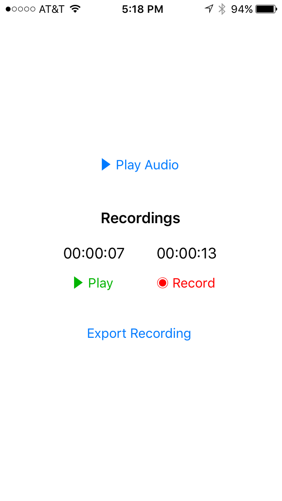

# TAAE2 with Swift

This Xcode project demonstrates how to trigger audio loops, apply effects, and export audio (via [AudioShare SDK](https://github.com/lijon/AudioShareSDK) by [Jonatan Liljedahl](https://github.com/lijon), Email Composer, AirDrop), using [The Amazing Audio Engine 2](https://github.com/TheAmazingAudioEngine/TheAmazingAudioEngine2) by [Michael Tyson](https://github.com/michaeltyson).

### Features & Specifications:

* The audio engine is managed in the bridged Objective-C `AEAudioController` class.
* 4 audio loops composed and exported from the [Korg Gadget](https://itunes.apple.com/us/app/korg-gadget/id791077159?mt=8&at=10l3KX&ct=github-gadget) iOS app.
* Distortion and delay effects are applied to only the "melody" audio loop.
* Reverb is applied to the entire audio output mix.
* The audio's current time in seconds is displayed in timecode.
* Ability to export the recorded audio via AudioShare (requires [AudioShare SDK](https://github.com/lijon/AudioShareSDK)), Email, AirDrop, Message, Notes, and more.
* Audio recording is accessible via iTunes File Sharing.
* Minimum requirements: iOS 8
* Authored with Xcode 7.3.1 and Swift 2.
